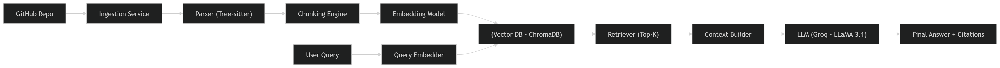

<div align="center">

<br />

```
██████╗ ███████╗██████╗  ██████╗ ███╗   ███╗██╗███╗   ██╗██████╗
██╔══██╗██╔════╝██╔══██╗██╔═══██╗████╗ ████║██║████╗  ██║██╔══██╗
██████╔╝█████╗  ██████╔╝██║   ██║██╔████╔██║██║██╔██╗ ██║██║  ██║
██╔══██╗██╔══╝  ██╔═══╝ ██║   ██║██║╚██╔╝██║██║██║╚██╗██║██║  ██║
██║  ██║███████╗██║     ╚██████╔╝██║ ╚═╝ ██║██║██║ ╚████║██████╔╝
╚═╝  ╚═╝╚══════╝╚═╝      ╚═════╝ ╚═╝     ╚═╝╚═╝╚═╝  ╚═══╝╚═════╝
```

**AI-powered codebase intelligence. Ask questions, get answers - with source citations.**

<br />

[](https://python.org)
[](https://fastapi.tiangolo.com)
[](https://nextjs.org)
[](https://langchain.com)
[](LICENSE)

<br />

> *"The best documentation is the codebase itself - if you can ask it questions."*

<br />

</div>

---

## What is RepoMind?

RepoMind is a developer tool that lets you **talk to any GitHub repository** in plain English. Point it at a codebase, and it ingests, indexes, and understands the code - then answers your questions with precise, cited responses that tell you exactly which file and line the answer came from.

No more grepping through unfamiliar codebases. No more reading 3,000 lines to find where auth is implemented. Just ask.

```
› How does authentication work in this project?

  Authentication is handled in src/middleware/auth.ts (line 12).
  The middleware validates JWT tokens on every protected route using
  the verifyToken() function, which checks the Authorization header
  and decodes the payload using jsonwebtoken...

  Sources: src/middleware/auth.ts · src/routes/user.ts · src/config/jwt.ts
```

---

## Architecture

<p align="center">
  
</p>

<p align="center"><em>End-to-end pipeline from repository ingestion to cited answer generation.</em></p>

---

## Tech Stack

| Layer | Technology | Purpose |
|---|---|---|
| **Ingestion** | `gitpython` | Clone public GitHub repos with depth=1 |
| **Parsing** | `tree-sitter` | AST-based chunking respecting function/class boundaries |
| **Embeddings** | `sentence-transformers` | Local embedding - no API key, no quota |
| **Vector Store** | `ChromaDB` | Persistent cosine-similarity search |
| **LLM** | `Groq` (llama-3.1-8b) | Fast inference, generous free tier |
| **API** | `FastAPI` | Async REST backend |
| **Frontend** | `Next.js 16` + `Tailwind v4` | Server-side React with CSS-first Tailwind |
| **Language** | `Python 3.11` + `TypeScript` | Fully typed across the stack |

---

## Features

- **AST-aware chunking** - splits code by function and class boundaries using tree-sitter, not arbitrary character counts. Retrieval quality is significantly better as a result.
- **Local embeddings** - `all-MiniLM-L6-v2` runs entirely on CPU. No OpenAI key required for indexing.
- **Source citations** - every answer tells you which file and line it came from.
- **Session caching** - repos are indexed once and reused. Re-querying the same repo is instant.
- **Interactive file tree** - collapsible explorer panel shows the full structure of the indexed repo.
- **Repo size guard** - rejects repos over 50MB to prevent runaway ingestion.
- **Multi-language support** - Python, JavaScript, TypeScript, Java, Go, Rust, C/C++, and more.
---

## Design Decisions

**Why tree-sitter for chunking?**
Most RAG implementations chunk by character count or line windows. This breaks functions in half, losing context. tree-sitter parses the AST and extracts complete, semantically meaningful units - a function stays whole, a class stays together. Retrieval quality is noticeably better.

**Why local embeddings?**
`sentence-transformers` runs on CPU with no API key, no quota, no cost, and no network dependency. For a developer tool that indexes code, this is the right tradeoff - embeddings happen once at ingest time and are cached.

**Why Groq over OpenAI?**
Groq's free tier is genuinely free with no billing setup. `llama-3.1-8b-instant` is fast enough for interactive use and sufficiently capable for code Q&A against retrieved context.


---

## License

MIT - see [LICENSE](LICENSE) for details.

---

<div align="center">

Built by [Priyanshu Kumar](https://github.com/BlackShort)

*If this helped you navigate an unfamiliar codebase, give it a star.*

</div>